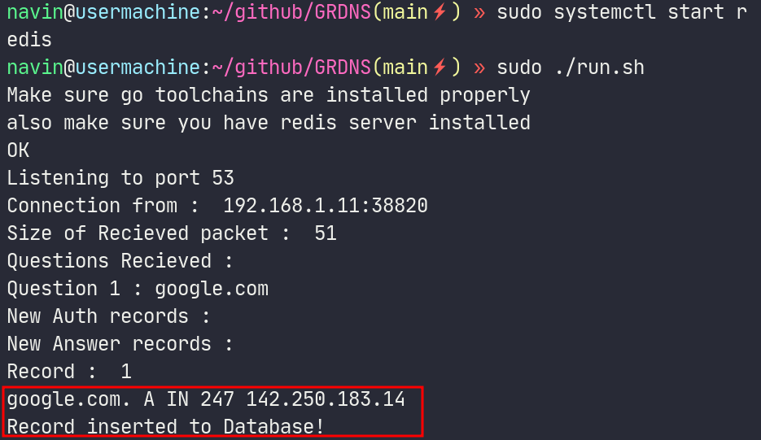
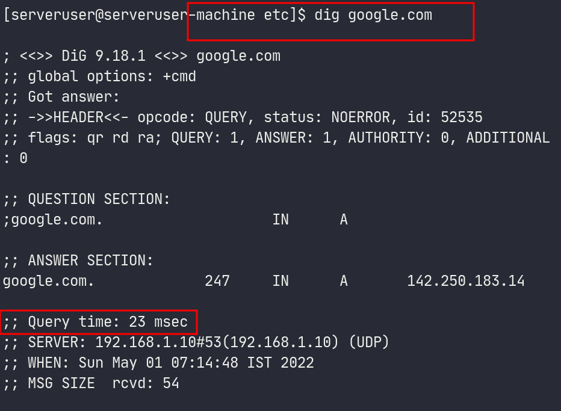
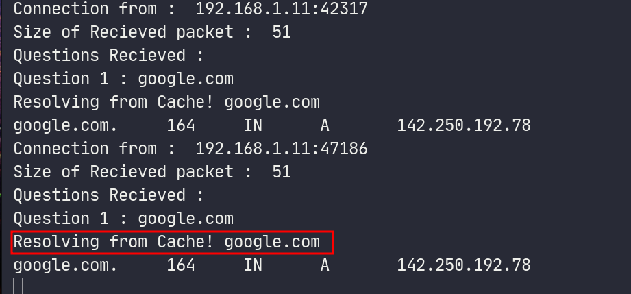
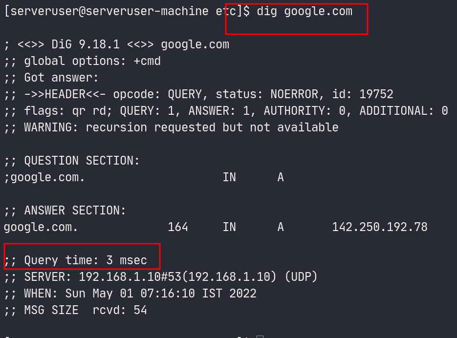

# GRDNS : A DNS caching/resolving server written in golang with redis DB

## Team Members : 
- P K Navin Shrinivas [PES2UG20CS237]
- Mohamed Ayaan [PES2UG20CS200]
- Mukund Deepak [PES2UG20CS206]

## Abstract of project 

The aim was to build a very fast and hyper stable multithreaded DNS server. We achieved the following during the project :
- Resolving from other known DNS server 
- Caching in redis database 
- Maintaining in-memory indexes of redis records for hyper fast resolve times 
- A moderately resiliant implementation of multi threading.


We surely wanted to do more on this project such as : 
- recursive resolving from root and TLD server. 
- Handle CNAME,NS records 
- More better multithreading database operations

But given the time frame for this project, all of the following could not be done.

## Output screenshots : 

**Server and DIG :** 

1.When resolving for the first time :





2.When resolving for the second time :





## The Project/Code : 

We have this project up on github and open for contributions at all times : [here](https://github.com/NavinShrinivas/GRDNS)

As for this submission, I have included only significant parts of the code as the code base is large and can not be fit in a pdf file (ZIP file attached instead).

Few significant parts of the code :  

**handle_request :**

```C
func handle_request(buffer []byte,Caddr *net.UDPAddr,Conn *net.UDPConn){
    packetlayers := gopacket.NewPacket(buffer,layers.LayerTypeDNS,gopacket.Default) 
    //Above gives a set of layer of the packet revieved
    //Where the DNS layer is filled with our Recieved bits
    DNSlayer := packetlayers.Layer(layers.LayerTypeDNS)
    //Above only extracts the DNS layer from set of layers 
    //with above layer we can create an object :) 
    DNSpacketObj := DNSlayer.(*layers.DNS)
    fmt.Println("Questions Recieved : ")
    for i,it:=range DNSpacketObj.Questions{
        fmt.Println("Question",i+1,":",string(it.Name))

        req_id := DNSpacketObj.ID; //Used by All DNS systems to ensure authenticity
        var response = new(dns.Msg);
        if EntryExists(string(it.Name)){
            response.MsgHdr.Response = true;
            response.MsgHdr.Rcode = 0; //No error handling :(
            response.MsgHdr.RecursionDesired = true;
            l := new(dns.Msg)
            l.Unpack(buffer)
            response.Question = l.Question;
            ReturnWithAnswers(string(it.Name),response)

        }else{
           response = resolve(string(it.Name))
        }
        

        if response!=nil{         
            response.MsgHdr.Id = req_id;
            resbuf,_ := response.Pack()

            //Writing back to client
            _, err := Conn.WriteToUDP(resbuf, Caddr)
            checkError(err)
        }
    }
}
```

**database function :**

```C
func FlushToDB(Record ResponseStruct) bool {

    var pool = newPool()
    var c = pool.Get()

    _,err := c.Do("HSET", record_number,"name", Record.Name,"ttl",Record.Rawttl, "class",\
    Record.Rawclass, "type", Record.Rawrrtype, "reply", Record.Rawstr,"length",Record.Rawrdlength)
    if err != nil {
        checkError(err)
        return false
    }
    domain_map[Record.Name] = append(domain_map[Record.Name],record_number)
    record_number++;
    fmt.Println("Record inserted to Database!")
    return true
}
```
